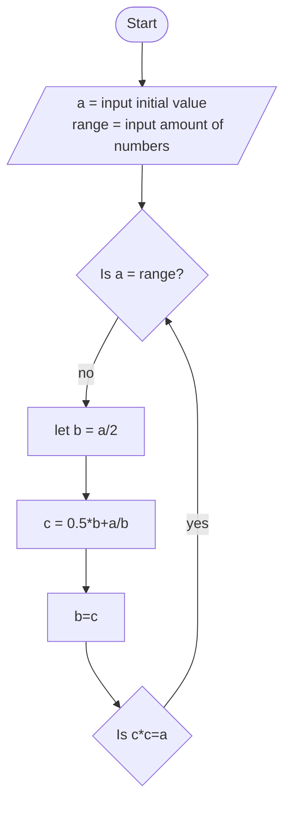

# flowchartsComp1236

```mermaid
flowchart TB
    A([Start])
    A-->B[/a = input initial value
    range = input amount of numbers/]
    B-->D{Is a = range?}
    D-- no -->E[let b = a/2]
    E-->F[c = 0.5*b+a/b]
    F-->G[b=c]
    G-->H{Is c*c=a}
    H--yes-->D

```