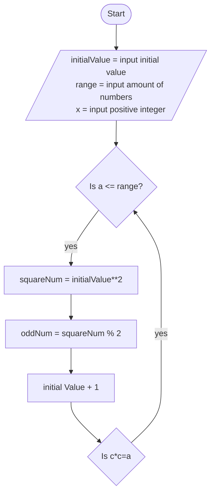

# flowchartsComp1236

Pseudocode
set initialValue = input initial value
set range = input range
set x = input positive integer

while initialValue <= range
    let squareNum = initialValue ** 2
    let oddNum = squareNum % 2
    let factor = x % squareNum
    let consNum = (initialValue + 1)**2
     
    if oddNum = 1
        print squareNum
    endif
    
    if initialValue < range
        let sumNum = squareNum + consNum
        print sumNum
    endif

    if factor = 0
        print "Yes, squareNum is a factor x."
    endif
    
    let initialValue = initialValue + 1

endwhile
    

    

